TCGA tests
================

``` r
library(TCGAbiolinks)
library(janitor)
```

    ## 
    ## Attaching package: 'janitor'

    ## The following objects are masked from 'package:stats':
    ## 
    ##     chisq.test, fisher.test

``` r
library(SummarizedExperiment)
```

    ## Loading required package: MatrixGenerics

    ## Loading required package: matrixStats

    ## 
    ## Attaching package: 'MatrixGenerics'

    ## The following objects are masked from 'package:matrixStats':
    ## 
    ##     colAlls, colAnyNAs, colAnys, colAvgsPerRowSet, colCollapse,
    ##     colCounts, colCummaxs, colCummins, colCumprods, colCumsums,
    ##     colDiffs, colIQRDiffs, colIQRs, colLogSumExps, colMadDiffs,
    ##     colMads, colMaxs, colMeans2, colMedians, colMins, colOrderStats,
    ##     colProds, colQuantiles, colRanges, colRanks, colSdDiffs, colSds,
    ##     colSums2, colTabulates, colVarDiffs, colVars, colWeightedMads,
    ##     colWeightedMeans, colWeightedMedians, colWeightedSds,
    ##     colWeightedVars, rowAlls, rowAnyNAs, rowAnys, rowAvgsPerColSet,
    ##     rowCollapse, rowCounts, rowCummaxs, rowCummins, rowCumprods,
    ##     rowCumsums, rowDiffs, rowIQRDiffs, rowIQRs, rowLogSumExps,
    ##     rowMadDiffs, rowMads, rowMaxs, rowMeans2, rowMedians, rowMins,
    ##     rowOrderStats, rowProds, rowQuantiles, rowRanges, rowRanks,
    ##     rowSdDiffs, rowSds, rowSums2, rowTabulates, rowVarDiffs, rowVars,
    ##     rowWeightedMads, rowWeightedMeans, rowWeightedMedians,
    ##     rowWeightedSds, rowWeightedVars

    ## Loading required package: GenomicRanges

    ## Loading required package: stats4

    ## Loading required package: BiocGenerics

    ## 
    ## Attaching package: 'BiocGenerics'

    ## The following objects are masked from 'package:stats':
    ## 
    ##     IQR, mad, sd, var, xtabs

    ## The following objects are masked from 'package:base':
    ## 
    ##     anyDuplicated, aperm, append, as.data.frame, basename, cbind,
    ##     colnames, dirname, do.call, duplicated, eval, evalq, Filter, Find,
    ##     get, grep, grepl, intersect, is.unsorted, lapply, Map, mapply,
    ##     match, mget, order, paste, pmax, pmax.int, pmin, pmin.int,
    ##     Position, rank, rbind, Reduce, rownames, sapply, saveRDS, setdiff,
    ##     table, tapply, union, unique, unsplit, which.max, which.min

    ## Loading required package: S4Vectors

    ## 
    ## Attaching package: 'S4Vectors'

    ## The following object is masked from 'package:utils':
    ## 
    ##     findMatches

    ## The following objects are masked from 'package:base':
    ## 
    ##     expand.grid, I, unname

    ## Loading required package: IRanges

    ## Loading required package: GenomeInfoDb

    ## Loading required package: Biobase

    ## Welcome to Bioconductor
    ## 
    ##     Vignettes contain introductory material; view with
    ##     'browseVignettes()'. To cite Bioconductor, see
    ##     'citation("Biobase")', and for packages 'citation("pkgname")'.

    ## 
    ## Attaching package: 'Biobase'

    ## The following object is masked from 'package:MatrixGenerics':
    ## 
    ##     rowMedians

    ## The following objects are masked from 'package:matrixStats':
    ## 
    ##     anyMissing, rowMedians

``` r
library(dplyr)
```

    ## 
    ## Attaching package: 'dplyr'

    ## The following object is masked from 'package:Biobase':
    ## 
    ##     combine

    ## The following objects are masked from 'package:GenomicRanges':
    ## 
    ##     intersect, setdiff, union

    ## The following object is masked from 'package:GenomeInfoDb':
    ## 
    ##     intersect

    ## The following objects are masked from 'package:IRanges':
    ## 
    ##     collapse, desc, intersect, setdiff, slice, union

    ## The following objects are masked from 'package:S4Vectors':
    ## 
    ##     first, intersect, rename, setdiff, setequal, union

    ## The following objects are masked from 'package:BiocGenerics':
    ## 
    ##     combine, intersect, setdiff, union

    ## The following object is masked from 'package:matrixStats':
    ## 
    ##     count

    ## The following objects are masked from 'package:stats':
    ## 
    ##     filter, lag

    ## The following objects are masked from 'package:base':
    ## 
    ##     intersect, setdiff, setequal, union

``` r
library(here)
```

    ## here() starts at /workspaces/TCGA

``` r
library(rmarkdown)
library(org.Hs.eg.db)
```

    ## Loading required package: AnnotationDbi

    ## 
    ## Attaching package: 'AnnotationDbi'

    ## The following object is masked from 'package:dplyr':
    ## 
    ##     select

    ## 

``` r
library("clusterProfiler")
```

    ## 

    ## clusterProfiler v4.14.4 Learn more at https://yulab-smu.top/contribution-knowledge-mining/
    ## 
    ## Please cite:
    ## 
    ## Guangchuang Yu, Li-Gen Wang, Yanyan Han and Qing-Yu He.
    ## clusterProfiler: an R package for comparing biological themes among
    ## gene clusters. OMICS: A Journal of Integrative Biology. 2012,
    ## 16(5):284-287

    ## 
    ## Attaching package: 'clusterProfiler'

    ## The following object is masked from 'package:AnnotationDbi':
    ## 
    ##     select

    ## The following object is masked from 'package:IRanges':
    ## 
    ##     slice

    ## The following object is masked from 'package:S4Vectors':
    ## 
    ##     rename

    ## The following object is masked from 'package:stats':
    ## 
    ##     filter

``` r
library(ggplot2)
library(ggfortify)
library(ComplexHeatmap)
```

    ## Loading required package: grid

    ## ========================================
    ## ComplexHeatmap version 2.22.0
    ## Bioconductor page: http://bioconductor.org/packages/ComplexHeatmap/
    ## Github page: https://github.com/jokergoo/ComplexHeatmap
    ## Documentation: http://jokergoo.github.io/ComplexHeatmap-reference
    ## 
    ## If you use it in published research, please cite either one:
    ## - Gu, Z. Complex Heatmap Visualization. iMeta 2022.
    ## - Gu, Z. Complex heatmaps reveal patterns and correlations in multidimensional 
    ##     genomic data. Bioinformatics 2016.
    ## 
    ## 
    ## The new InteractiveComplexHeatmap package can directly export static 
    ## complex heatmaps into an interactive Shiny app with zero effort. Have a try!
    ## 
    ## This message can be suppressed by:
    ##   suppressPackageStartupMessages(library(ComplexHeatmap))
    ## ========================================

# PCA of TCGA data

This follows pretty much the blog post from
[Chatomics1](https://divingintogeneticsandgenomics.com/post/pca-tcga/)
and
[Chatomics2](https://divingintogeneticsandgenomics.com/post/pca-tcga2/?s=09)
since I wanted to test a few things and that was going right into a
similar direction :) The gist is essentially how to access TCGA through
R api and doing exploratory data anaylsis (EDA). For this purpose, we
download data from 2 different cancer types, Lung adenocarcinoma (LUAD)
and LUSC (lung squamous cell carcinoma).

There is as well from TCGA a nice
[tutorial](https://bioconductor.org/packages/release/bioc/vignettes/TCGAbiolinks/inst/doc/analysis.html)
which we might want to use to cycle back or re-investigate again
occasionally.

Similarly, there is [here a case
study](https://bioconductor.org/packages/release/bioc/vignettes/TCGAbiolinks/inst/doc/casestudy.html)
for pan-cancer BRCA downstram analysis which might be very helpful.

## LUAD

Get Lung cancer data , more detailed information for downloading can be
found [in the
doscs](https://bioconductor.org/packages/release/bioc/vignettes/TCGAbiolinks/inst/doc/download_prepare.html)

``` r
# This one should only be done once and the rds file been kept
# Therefore it is excluded from the report generation
LUAD_query <- GDCquery(project = "TCGA-LUAD",
                  data.category = "Transcriptome Profiling",
                  data.type = "Gene Expression Quantification",
                  workflow.type = "STAR - Counts")

GDCdownload(LUAD_query)
TCGA_LUAD_data <- GDCprepare(LUAD_query)
saveRDS(TCGA_LUAD_data, "./data/TCGA_LUAD_SummarizedExperiment.rds")
```

``` r
TCGA_LUAD_data<- readRDS("./data/TCGA_LUAD_SummarizedExperiment.rds")
# save the raw counts matrix 
TCGA_LUAD_mat<- assay(TCGA_LUAD_data)

methy_LUAD <- colData(TCGA_LUAD_data) %>% as.data.frame() %>% tabyl(`paper_CIMP.methylation.signature.`)
```

We have in total 600 samples in the sunmmarized experiment Lets have a
look at methylation sub-types

We can see that there is plenty of NA values. In the raw count data,
they have ensemble IDs for each gene :

## LUSC

Get Lung cancer data , more detailed information for downloading can be
found [in the
doscs](https://bioconductor.org/packages/release/bioc/vignettes/TCGAbiolinks/inst/doc/download_prepare.html)

``` r
# This one should only be done once and the rds file been kept
# Therefore it is excluded from the report generation
LUSC_query <- GDCquery(project = "TCGA-LUSC",
                  data.category = "Transcriptome Profiling",
                  data.type = "Gene Expression Quantification",
                  workflow.type = "STAR - Counts")

GDCdownload(LUSC_query)
TCGA_LUSC_data <- GDCprepare(LUSC_query)
saveRDS(TCGA_LUSC_data, "./data/TCGA_LUSC_SummarizedExperiment.rds")
```

``` r
TCGA_LUSC_data<- readRDS("./data/TCGA_LUSC_SummarizedExperiment.rds")
# save the raw counts matrix 
TCGA_LUSC_mat<- assay(TCGA_LUSC_data)
```

We have in total 562 samples in the sunmmarized experiment

In the raw count data, they have ensemble IDs for each gene :

## Harmonization

We want to have instead of ensemble IDs the GENE ID or better even gene
symbols.

``` r
TCGA_LUAD_genes <- rownames(TCGA_LUAD_mat)%>% tibble::enframe() %>% mutate(ENSEMBL=stringr::str_replace(value,pattern="\\.[0-9]+",replace=""))
TCGA_LUSC_genes <- rownames(TCGA_LUSC_mat)%>% tibble::enframe() %>% mutate(ENSEMBL=stringr::str_replace(value,pattern="\\.[0-9]+",replace=""))
```

These have (non-surprisingly) the same sizes of total genes: 60660

Now there are some which are duplicated in there on the gene level as we
have multiple transcripts per genes. They used a package called
[clusterProfiler](https://bioconductor.org/packages/release/bioc/html/clusterProfiler.html)
for the conversion of the IDs, I think personally I would have rather
gone for
[biomart](https://bioconductor.org/packages/release/bioc/html/biomaRt.html).
I assume because this package allows more complex analysis on top of it
and therefore reduces the number of total dependencies [see recent
paper](https://www.cell.com/the-innovation/fulltext/S2666-6758(21)00066-7?_returnURL=https%3A%2F%2Flinkinghub.elsevier.com%2Fretrieve%2Fpii%2FS2666675821000667%3Fshowall%3Dtrue).

``` r
example_dup <- clusterProfiler::bitr(TCGA_LUAD_genes$ENSEMBL, 
                      fromType = "ENSEMBL",
                      toType = "SYMBOL",
                      OrgDb = org.Hs.eg.db) %>%
        janitor::get_dupes(SYMBOL) %>%
        head()
```

    ## 'select()' returned 1:many mapping between keys and columns

    ## Warning in clusterProfiler::bitr(TCGA_LUAD_genes$ENSEMBL, fromType = "ENSEMBL",
    ## : 40.14% of input gene IDs are fail to map...

``` r
TCGA_LUAD_gene_map <- clusterProfiler::bitr(TCGA_LUAD_genes$ENSEMBL, 
                      fromType = "ENSEMBL",
                      toType = "SYMBOL",
                      OrgDb = org.Hs.eg.db) %>%
                distinct(SYMBOL, .keep_all = TRUE)
```

    ## 'select()' returned 1:many mapping between keys and columns

    ## Warning in clusterProfiler::bitr(TCGA_LUAD_genes$ENSEMBL, fromType = "ENSEMBL",
    ## : 40.14% of input gene IDs are fail to map...

``` r
TCGA_LUAD_gene_map <- TCGA_LUAD_gene_map %>% left_join(TCGA_LUAD_genes)
```

    ## Joining with `by = join_by(ENSEMBL)`

``` r
TCGA_LUSC_gene_map <- TCGA_LUAD_gene_map %>% left_join(TCGA_LUSC_genes)
```

    ## Joining with `by = join_by(ENSEMBL, name, value)`

here we can see some duplicates . By using the map from the cluster
profiler we have now a mapping similar to this :

We can use now this mappings to take our initial expression matrices and
replace the Ensemble ID with the gene Symbols. Important: this will
reduce our set significantly

``` r
old <- dim(TCGA_LUSC_mat)
TCGA_LUSC_mat <- TCGA_LUSC_mat[TCGA_LUSC_gene_map$value,]
new <- dim(TCGA_LUSC_mat)
rownames(TCGA_LUSC_mat) <- TCGA_LUSC_gene_map$SYMBOL

TCGA_LUAD_mat <- TCGA_LUAD_mat[TCGA_LUAD_gene_map$value,]
rownames(TCGA_LUAD_mat) <- TCGA_LUAD_gene_map$SYMBOL
```

from originally to now elements.

## Combination

Now we combine both of them together before doing the comparison

``` r
all.equal(rownames(TCGA_LUAD_mat),rownames(TCGA_LUSC_mat))
```

    ## [1] TRUE

``` r
combined_mat  <- cbind(TCGA_LUAD_mat,TCGA_LUSC_mat)
# The only problem is that we have still not real sample data but the TCGA case numbers

TCGA_lung_meta <- data.frame(cancer_type = c(rep( "LUSC", ncol(TCGA_LUSC_mat)), 
                   rep("LUAD", ncol(TCGA_LUAD_mat))))
```

## PCA analysis

In general for these type of analysis we often dont want to take all but
maybe only the top 2000 most variable ones.

### Raw counts

``` r
most_var_subset_ix <- order(rowVars(combined_mat),decreasing=TRUE)[1:2000]
most_var_subset    <- combined_mat[most_var_subset_ix,]
most_var_pca      <- prcomp(t(most_var_subset),scale.=TRUE)
autoplot(most_var_pca, data=TCGA_lung_meta, color ="cancer_type") + ggtitle("PCA combined lung cancer")
```

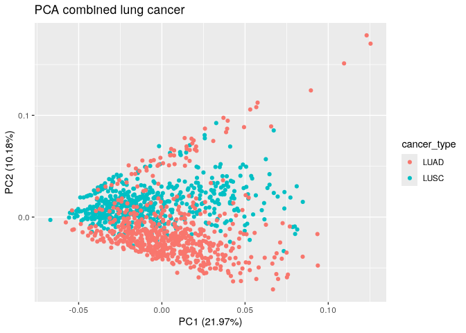<!-- -->

They are not clearly separable by PC1 which accounts for 20 %
variability, but then they are coming from different experiments and we
took simply the counts. These are though strongly affected by the number
of sequenced reads and not normalized within and neither between
experiments. Now if we assume that this is true, then we would expect
that the sum of counts for a given sample would directly correlate with
it’s PCA value. PC2 is looking better for separation

``` r
nreads <- colSums(most_var_subset)
cor(most_var_pca$x[,1],nreads)
```

    ## [1] 0.9489841

``` r
PCA_overview <- bind_rows(lapply(1:5,function(x){
    data.frame(PC=x,correlation=cor(most_var_pca$x[,x],nreads))
}))
```

So, the first PC is pretty useless because it correlates extremely with
number of counts per sample But the PC2 seems not strongly affected by
the counts of reads.

``` r
TCGA_lung_meta$seq_depth<-nreads
autoplot(most_var_pca, data=TCGA_lung_meta, color ="seq_depth") + scale_color_viridis_b() + ggtitle("PCA combined lung cancer with depth")
```

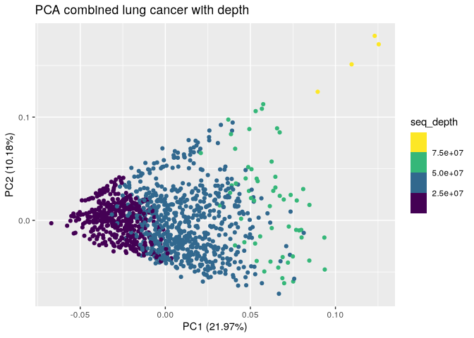<!-- --> Yeah,
looks quite obvious indeed.

### CPM normalized

So normally we always normalize, lets do that next.

``` r
combined_mat_cpm <- edgeR::cpm(combined_mat,prior.count=TRUE,log=TRUE)
most_var_cpm_subset_ix <- order(rowVars(combined_mat_cpm),decreasing=TRUE)[1:2000]
most_var_cpm_subset    <- combined_mat_cpm[most_var_cpm_subset_ix,]
most_var_cpm_pca      <- prcomp(t(most_var_cpm_subset),scale.=TRUE)
autoplot(most_var_cpm_pca, data=TCGA_lung_meta, color ="cancer_type") + ggtitle("PCA log2CPM combined lung cancer")
```

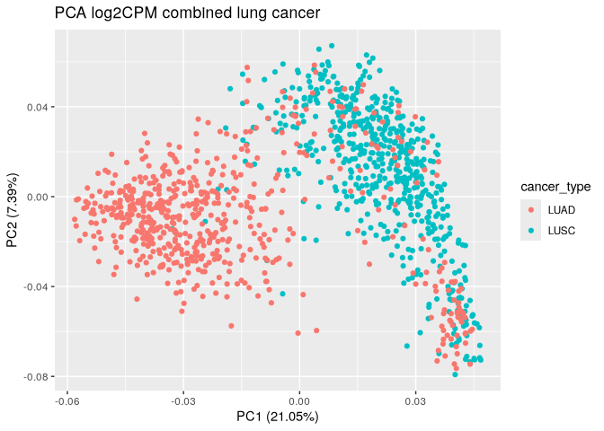<!-- -->

Yeah, that looks much more convincing obviously.

## Heatmap

Here we choose again our 2000 most variable genes

``` r
annot_lung <- HeatmapAnnotation(df = TCGA_lung_meta, col= list(cancer_type= c("LUSC"="red","LUAD"="steelblue")))
Heatmap(most_var_cpm_subset,
    name="Lung cancer log2CPM",
    top_annotation = annot_lung,
    show_column_names = FALSE,
    show_row_names = FALSE,
    show_row_dend = FALSE,
    border = TRUE,
    row_km = 6
)
```

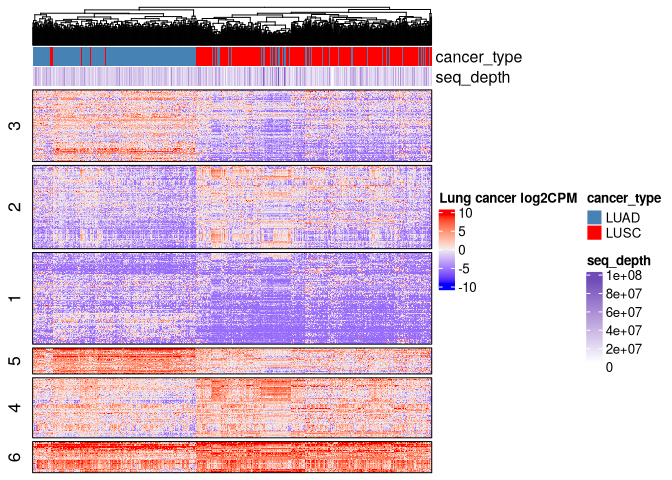<!-- -->

So we can see very nicely now the cluster of genes which are up in both,
down in both or really different between both cancer type annotations.
The samples are as well predominantly well separating.

# In depth analysis

Now since we see major differences we can check if some of the know
markers are popping up here as well.

> LUAD originates in the alveolar epithelial cells and is often
> associated with EGFR mutations, particularly in non-smokers

> NKX2-1 (TTF-1) Lung epithelial differentiation marker. Highly
> expressed in LUAD but absent in LUSC (TCGA, IHC studies).

> NAPSA (Napsin A). Aspartic protease in surfactant protein processing.
> High specificity for LUAD (IHC studies).

The first one is a bit more tricky to check as we will have to circle
back to the mutation data. Lets do that later, first have a look at the
expression of these genes and whether they stand out somehow.

``` r
TCGA_lung_meta$NAPSA <- combined_mat_cpm["NAPSA", ]
TCGA_lung_meta$TFF1 <- combined_mat_cpm["TFF1", ]
TCGA_lung_meta$EGFR <- combined_mat_cpm["EGFR", ]

autoplot(most_var_cpm_pca, data = TCGA_lung_meta , color ="TFF1") +
        scale_color_viridis_b() +
        facet_wrap(~ cancer_type) + 
        ggtitle("TCGA TFF1")
```

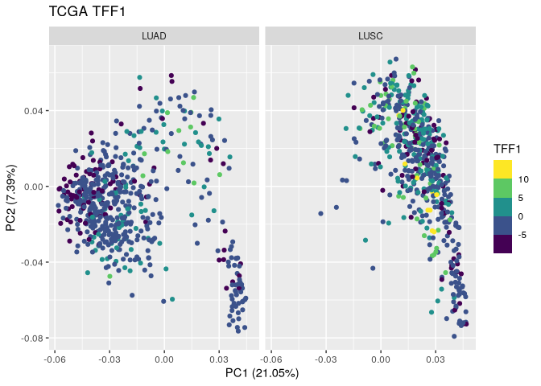<!-- -->

``` r
autoplot(most_var_cpm_pca, data = TCGA_lung_meta , color ="NAPSA") +
        scale_color_viridis_b() +
        facet_wrap(~ cancer_type) + 
        ggtitle("TCGA NAPSA")
```

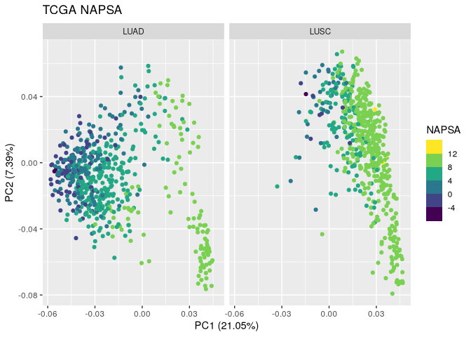<!-- -->

``` r
autoplot(most_var_cpm_pca, data = TCGA_lung_meta , color ="EGFR") +
        scale_color_viridis_b() +
        facet_wrap(~ cancer_type) + 
        ggtitle("TCGA EGFR")
```

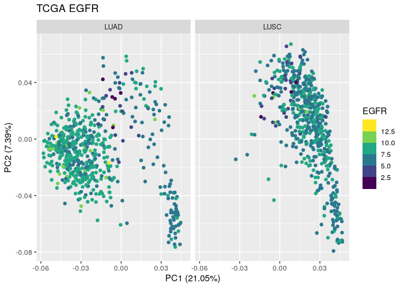<!-- -->

They are obviously the identical plots, and only the color labels are
changing. Lets have a quick look at the distribution of these:

``` r
ggplot(TCGA_lung_meta,aes(x=TFF1, fill=cancer_type)) + facet_wrap(~cancer_type)+ geom_density() + ggtitle("TFF1 expression")
```

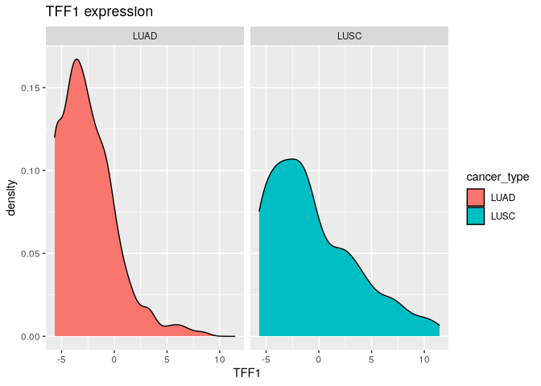<!-- -->

``` r
ggplot(TCGA_lung_meta,aes(x=NAPSA, fill=cancer_type)) + facet_wrap(~cancer_type)+ geom_density() + ggtitle("NAPSA expression")
```

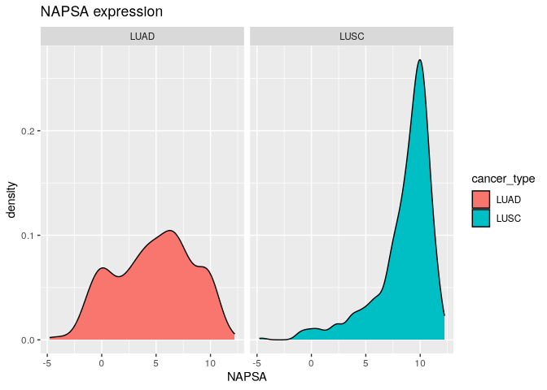<!-- -->

``` r
ggplot(TCGA_lung_meta,aes(x=EGFR, fill=cancer_type)) + facet_wrap(~cancer_type)+ geom_density() + ggtitle("EGFR expression")
```

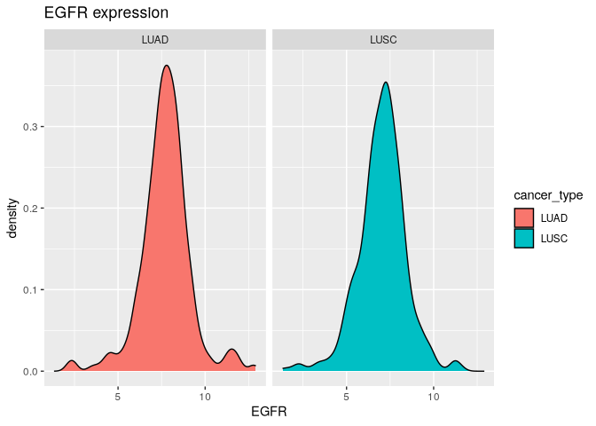<!-- -->

TTF1 does on both plots look not very impressive - meaning already low
expression and similar distribution. Same for the EGFR expression. But
NAPSA looks indeed already quite different between both types. It seems
that the PC1 is pretty well separating the 2 cancer types based on the
expression of NAPSA, except for some samples. The question might be if
these are mislabeled ?

There are other potential markers that are known in the literature:

> TP63 (ΔNp63). Transcription factor crucial for squamous
> differentiation.High expression in LUSC, absent in LUAD (TCGA, IHC
> studies).

> KRT5 (Cytokeratin 5). Cytoskeletal protein in basal epithelial cells.
> Expressed in LUSC, absent in LUAD.

Lets do the same game as for the others before:

``` r
TCGA_lung_meta$TP63 <- combined_mat_cpm["TP63", ]
TCGA_lung_meta$KRT5 <- combined_mat_cpm["KRT5", ]

autoplot(most_var_cpm_pca, data = TCGA_lung_meta , color ="TP63") +
        scale_color_viridis_b() +
        facet_wrap(~ cancer_type) + 
        ggtitle("TCGA TP63")
```

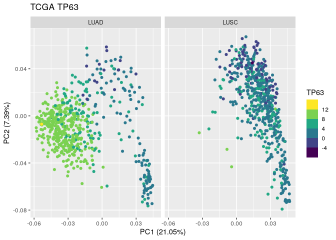<!-- -->

``` r
autoplot(most_var_cpm_pca, data = TCGA_lung_meta , color ="KRT5") +
        scale_color_viridis_b() +
        facet_wrap(~ cancer_type) + 
        ggtitle("TCGA KRT5")
```

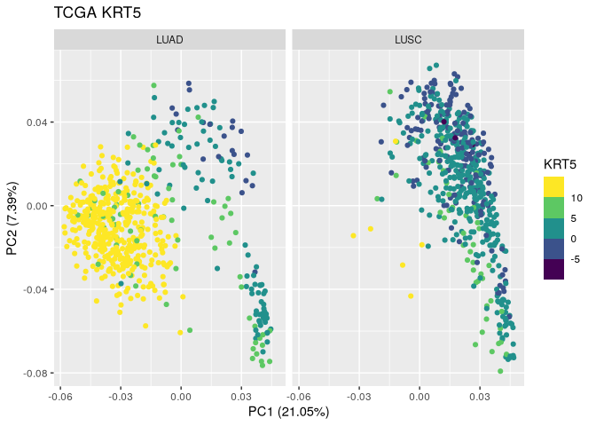<!-- -->

Indeed, these ones are crazy specific.

``` r
ggplot(TCGA_lung_meta,aes(x=TP63, fill=cancer_type)) + facet_wrap(~cancer_type)+ geom_density() + ggtitle("TP63 expression")
```

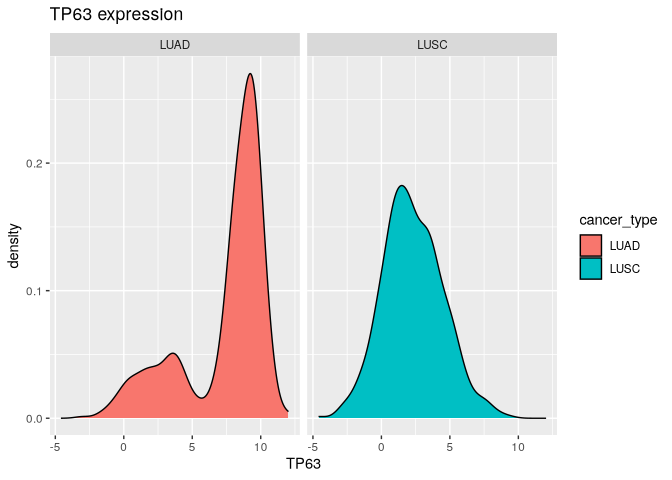<!-- -->

``` r
ggplot(TCGA_lung_meta,aes(x=KRT5, fill=cancer_type)) + facet_wrap(~cancer_type)+ geom_density() + ggtitle("KRT5 expression")
```

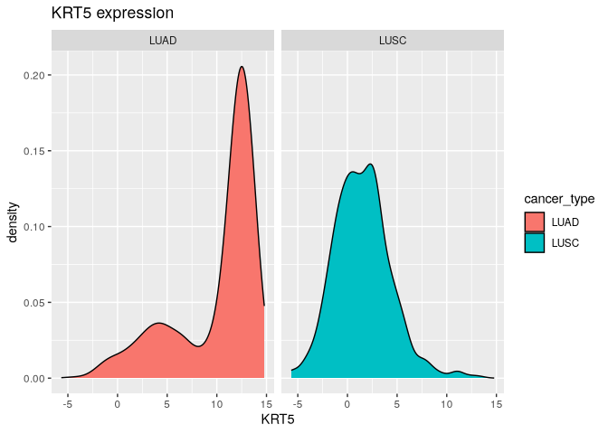<!-- -->

And we see again the same effect that there are some LUAD ones which
seem bizzare and in the PC1 below 0. Lets take these samples and have a
better look at them

``` r
TCGA_lung_meta$PC1_low <- most_var_cpm_pca$x[, 1] < 0 
TCGA_lung_meta$PC1_high <- most_var_cpm_pca$x[, 1] > 0
# the ones which are lower 0 but annotated LUAD
```

How many samples are these which are LUAD annotated but PC1 \< 0 : 115
That’s still many and unlikely to be a labeling problem as it represents
in totla 19.1666667 percent of the samples How many samples are these
which are LUSC annotated but PC1 \> 0 : 45 The other way around we have
only 8.0071174 percent of the samples. That is more likely to be a
mislabeling - but I doubt it. More likely is that it is not a perfect
marker or our PC is not separating them perfectly.

# SNV comparison

``` r
# This one should only be done once and the rds file been kept
# Therefore it is excluded from the report generation
LUSC_query_snv <- GDCquery(project = "TCGA-LUSC",
                    data.category = "Simple Nucleotide Variation",
                    access = "open",
                    data.type = "Masked Somatic Mutation", 
                    workflow.type = "Aliquot Ensemble Somatic Variant Merging and Masking")

GDCdownload(LUSC_query_snv)
TCGA_LUSC_snv_data <- GDCprepare(LUSC_query_snv)
saveRDS(TCGA_LUSC_snv_data, "./data/TCGA_LUSC_SNV_SummarizedExperiment.rds")
```

``` r
# This one should only be done once and the rds file been kept
# Therefore it is excluded from the report generation
LUAD_query_snv <- GDCquery(project = "TCGA-LUAD",
                    data.category = "Simple Nucleotide Variation",
                    access = "open",
                    data.type = "Masked Somatic Mutation", 
                    workflow.type = "Aliquot Ensemble Somatic Variant Merging and Masking")

GDCdownload(LUAD_query_snv)
TCGA_LUAD_snv_data <- GDCprepare(LUAD_query_snv)
saveRDS(TCGA_LUAD_snv_data, "./data/TCGA_LUAD_SNV_SummarizedExperiment.rds")
```

to be continued….
